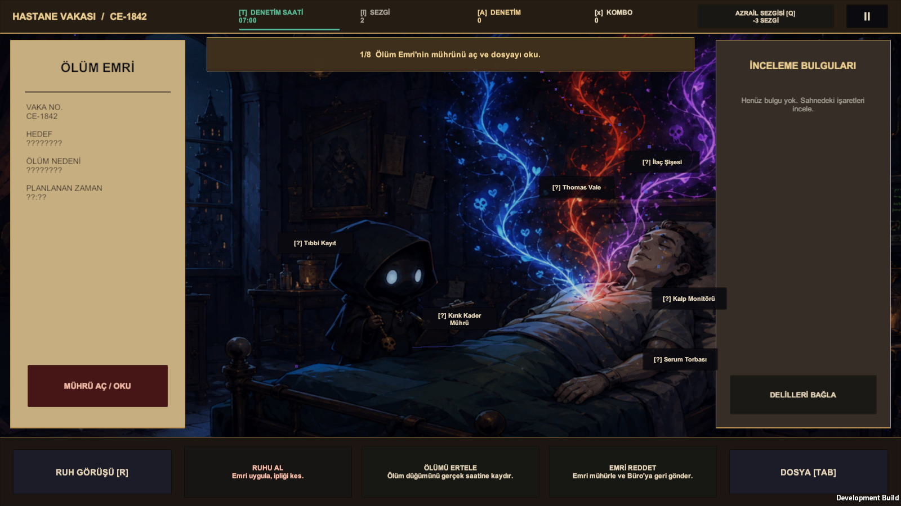
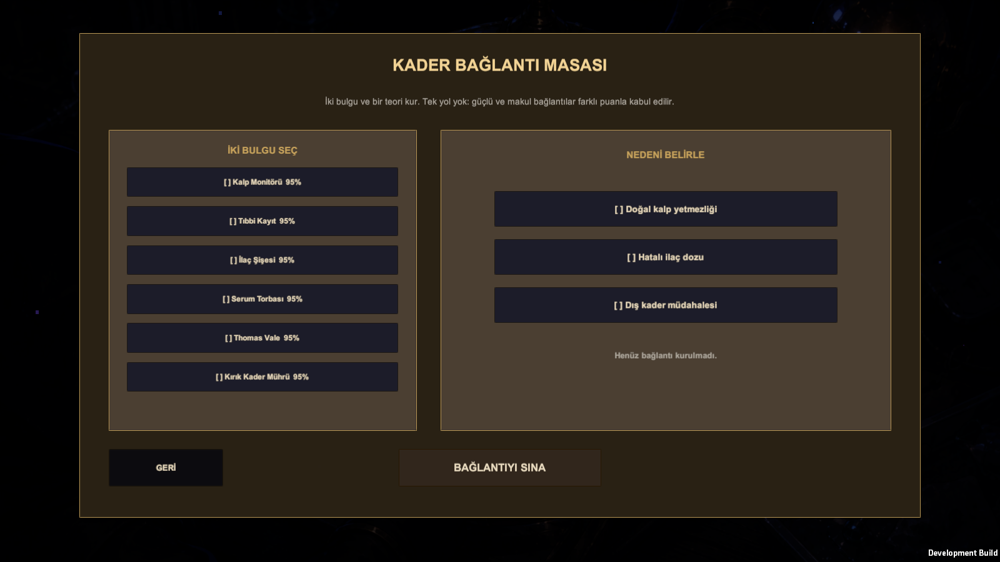

 

# Death Auditor

### Every death order deserves a second look.

A gothic investigation game about examining death orders, weighing evidence, and passing judgement.

| Status | Built with | Repository purpose |
| :--- | :--- | :--- |
| In development · Playable prototype | Unity · C# | Public project showcase |

## Screenshots

Screenshots from development builds. Interface and features may change before release.

*Hospital investigation scene*

*Deduction board*

## The experience

- Investigate atmospheric cases as a junior reaper.
- Connect evidence and examine inconsistencies in fate.
- Choose whether to take a soul, delay death, or reject an order.

## Development status

This project is a work in progress. The description reflects the current direction and may change during development; it is not a release announcement.

## Türkçe

**Üzerinde çalışılıyor.** Ölüm emirlerini denetlediğin gotik bir araştırma oyunu. Kanıtları incele, kaderdeki tutarsızlıkları araştır ve hükmünü ver.

## About this repository

This repository contains presentation material only. Game source code, project files, original asset packs, and internal development documents are not distributed here.

No open-source license is granted for the underlying project. Any third-party materials remain subject to their respective owners' rights.

---

[← Atakan Taner Gül — Portfolio](https://github.com/AtakanTGul)
